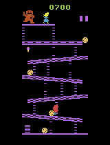
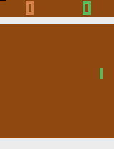

# Reinfrocement Learning Project

Final project for the Reinforcement Learnning subject. 
This project implements two reinforcement learning algorithms to train an agent to play the Atari games Breakout, Donkey Kong and Pong.

---

## Demo

Here is a demonstration of the agents's performance:

### Breakout


### Donkey Kong



### Pong

 

---

## Setup

1. Clone the repository:
```
git clone https://github.com/Arroch35/Reinfrocement-Learning-Project.git
cd Reinfrocement-Learning-Project
```

2. Create and activate a virtual environment (optional but recommended):
```
python -m venv venv
source venv/bin/activate  # On Windows: venv\Scripts\activate
```

3. Install the required dependencies:
```
pip install -r requirements.txt
```

---


## Train and test the models

In the folder 'src' you will find the files used to train and test the models. There are 3 folders, one for each game.

Before executing any of the files, make sure you change the kay value "YOUR_API_KEY" for your actuall wandb api key in the function wandb.init(). 

Depending on the game or algorithm you want to train, you should use one of the following commands:
```
jupyter notebook src/breakout/part1_DQN.ipynb  # To train the DQN algorithm on Breakout
jupyter notebook src/breakout/part1_REINFORCE.ipynb  # To train the REINFORCE algorithm on Breakout
python src/donkeyKong/part2_PPO.py  # To train the PPO algorithm on Donkey Kong
python src/donkeyKong/part2_A2C.py  # To train the A2C algorithm on Donkey Kong
python src/pong/pong_left.py  # To train the Pong agent on the left
python src/pong/pong_right.py  # To train the Pong agent on the right
```
The files above are also used to test the models.

For the files of the part one, after the training, there will be saved the models and the videos. The models will be saved in the folder called models, and the videos in the folder called videos. 

For the files of the second and third part, there will be saved only the models. To make the video of the desired model of these parts, change the line of the code to load model *model = A2C.load("../models/best_model")* for the desired model. Then execute the following command:
```
jupyter notebook src/make_video.ipynb
```


