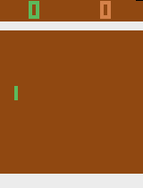

# Reinfrocement Learning Project

Final project for the Reinforcement Learnning subject. 
This project implements two reinforcement learning algorithms to train an agent to play the Atari games Breakout, Donkey Kong and Pong.

---

## Demo

Here is a demonstration of the agents's performance:

### Breakout


### Donkey Kong


### Pong

 

---

## Setup

1. Clone the repository:
```
git clone https://github.com/Arroch35/Reinfrocement-Learning-Project.git
cd Reinfrocement-Learning-Project
```

2. Create and activate a virtual environment (optional but recommended):
```
python -m venv venv
source venv/bin/activate  # On Windows: venv\Scripts\activate
```

3. Install the required dependencies:
```
pip install -r requirements.txt
```

---


## Train and test the models

In the folder 'src' you will find the files used to train and test the models. There are 3 folders, one for each game.

Before executing any of the files, make sure you change the kay value "YOUR_API_KEY" for your actuall wandb api key in the function wandb.init(). 

Depending on the game or algorithm you want to train, you should use one of the following commands:
```
jupyter notebook src/breakout/dqn.ipynb  # To train the DQN algorithm on Breakout
jupyter notebook src/breakout/reinforce.ipynb  # To train the REINFORCE algorithm on Breakout
python src/donkeyKong/a2c_final.py  # To train the A2C algorithm on Donkey Kong
python src/donkeyKong/ppo_final.py  # To train the PPO algorithm on Donkey Kong
python src/donkeyKong/ppo_final_frame_skipping.py  # To train the PPO algorithm on Donkey Kong where we climn ladder automatically
python src/donkeyKong/fine_tunning.py # To make combination of previous 2 models (ppo_final.py and ppo_final_frame_skipping.py).
python src/pong/pong_general_left.py  # To train the Pong agent on the left
python src/pong/pong_right.py  # To train the Pong agent on the right
```
The files dqn.ipynb and reinforce.ipynb are also used to test the models and create the videos.

To test the models or make the videos of Donkey Kong and Pong you must run one of the following commands.

Before running the commands, make sure you change the paths of the models for the desired models path.
```
jupyter notebook src/make_video.ipynb # To make videos
jupyter notebook src/evulate_model.ipynb # To evaluate the models of DonKEY Kong 
jupyter notebook src/pong_test.ipynb # To test the pong models separately
jupyter notebook src/pong_multi_agent_test.ipynb # To test the pong models together 
```


